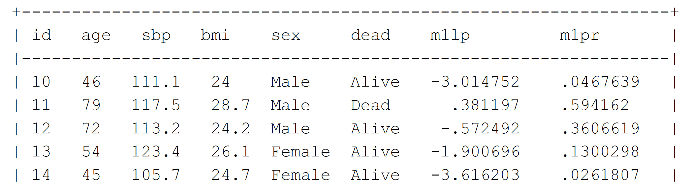
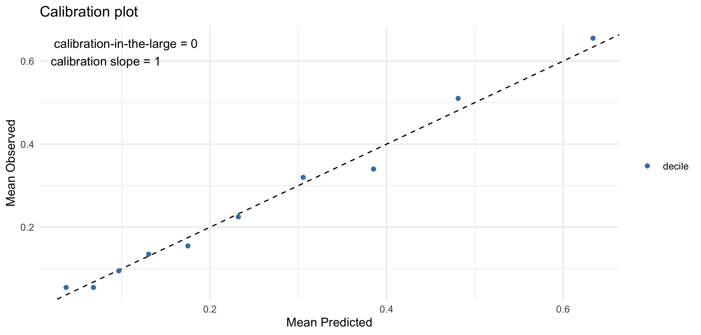

class: center, middle
background-color: #EEFAFC

```{r setup, include=FALSE}
options(htmltools.dir.version = FALSE)
knitr::opts_chunk$set(fig.retina = 3, message = F, warning = F)
```

```{r xaringan-themer, include = FALSE}
library(xaringanthemer)

base <- accent <- "#1261A5"
white <- "#fafafa"
black <- "#101010"
# accent2 <- "#A4DBE8"
style_mono_accent(
  base_color = base,
  black_color = "#101010",
  white_color = "#fafafa",
  header_font_google = google_font("Raleway"),
  header_color = darken_color(base, strength = 0.2),
  text_font_google   = google_font("Lato"),
  code_font_google   = google_font("Inconsolata"),
  table_row_even_background_color = "#f0f0f0",
  header_font_weight = "bold",
  text_font_size = "24px",
  link_color = "#D7263D",
  colors = c(
    accent = base,
    lightblue = "#98DFEA", blue = "blue", blue2  = "#36BDF2", blue3  = "#00F2F5",
    gray = "lightgray",
    yellow = "#FFCC66",
    red   = "red", crimson = "#D7263D",
    teal = "teal", brown = "brown",
    orange = "orange",
    green = "seagreen",
    violet = "darkorchid",
    purple = "purple",
    pink = "deeppink"
  )
)

extra_css <- list(
  ".shadow" = list("text-shadow" = "0 0 10px #000"),
  ".large" = list("font-size" = "120%"),
  ".big" = list("font-size" = "400%"),
  ".small" = list("font-size" = "90%"),
  ".smaller" = list("font-size" = "75%"),
  ".translucent" = list("opacity" = "0.4"),
  ".full-width" = list(
    display = "flex",
    width   = "100%",
    flex    = "1 1 auto"
  )
)

style_extra_css(extra_css)
```


# Risk Prediction

### Advanced Statistics for Records Research

<br/>
### .black[Albert Henry]

#### .black[UCL Institute of Health Informatics]

<br/><br/>
Online slides (CC licence: BY-SA-NC):

.lightblue[https://ihi-risk-teaching.netlify.app/]
---
## Learning objectives

This lecture will cover:

- __Types__ of prediction
- __2x2 contingency table__
- Metrics to evaluate __model performance__ 
- Model development and validation

in the context of __binary risk prediction__

<br/>
### Acknowledgements
Materials and data presented are based on previous slides prepared by L. Palla, D. Prieto, and E. Williamson


---
# Scenario

Consider a dataset consisting some variables collected from a group of individuals. We want to predict which individuals develop a certain __binary outcome $Y$__.

__Examples__

| Population          | Available data                                                     | Outcome to predict                         |
|---------------------|--------------------------------------------------------------------|--------------------------------------------|
| Surgical patients   | age, sex, comorbidities, medications, severity of disease          | complications after surgery                |
| Covid-19 patients   | age, sex, vaccination status, virus variant, chest X-ray            | ICU admission within 10 days               |
| Healthy individuals | body mass index, lifestyle, socioeconomic status, genotypes, lipid profile | myocardial infarction in 10-year follow-up |

*___Note___: prediction modelling is ___not___ limited to biomedical problems  

---
### Types of prediction: deterministic vs probabilistic

- __Deterministic:__

    - **Classify** each individual into one of the two possible outcomes.
    -  Often used in __(Supervised) Machine Learning__
    
- __Probabilistic:__
  
    - Assign each individual a **probability** of developing the outcome.
    - Often used in __Biostatistics__ and is known as __Risk Prediction*__

Both methods use individual-level data on a set of variables (or __predictors__) to develop a prediction model

.footnote[
__*__Other names: risk prediction model, predictive model, prognostic (or prediction) index or rule, and risk score
]

---
### Types of prediction: diagnostic vs prognostic
.center[


.smaller[Moons KGM, Altman DG, Reitsma JB, et al. Ann Intern Med. 2015 Jan 6;162(1):W1–73.]
]

---
## Example
.large[Who will develop myocardial infarction in the next 5 years?]

```{r, echo=FALSE, message=F}
library(tidyverse)
library(knitr)
library(kableExtra)

options(knitr.kable.NA = '')
# kable <- function(df, ...){
#   kable(df, align = "c", ...) %>% 
#     kable_styling(bootstrap_options = c("hover", "striped"),
#                 full_width = T, font_size = 20)
# }

df <- tibble(id = 1:10,
             age = c(35, 35, 55, 55, 65, 65, 75, 75, 85, 85),
             sex = c("F", "M", "F", "M", "F", "M", "M", "F", "F", "M") %>%
               factor(levels = c("F", "M")),
             diabet = c("Yes", "No", "No", "Yes", "No", "Yes", "Yes", "No", "Yes", "No"),
             SBP = c(145, 130, 115, 170, 135, 140, 160, 130, 130, 160),
             Classify = c("No", "No", "No", "Yes", "No", "Yes", "Yes", "No", "Yes", "Yes"),
             Predict = c(0.15, 0.05, 0.10, 0.55, 0.30, 0.52, 0.60, 0.40, 0.55, 0.60),
             Observed = c("No", "No", "No", "No", "Yes", "No", "Yes", "No", "Yes", "Yes")) %>% 
  mutate_at(vars(diabet, Classify, Observed),
            factor, levels = c("Yes", "No"))


df %>%
  mutate(Classify = NA, Predict = NA, Observed = NA) %>% 
  kable(align = "c") %>% 
  kable_styling(bootstrap_options = c("hover", "striped"),
                full_width = T, font_size = 20) %>% 
  row_spec(0, background = "#bbbbbb")
  # row_spec(1, bold = T, color = "white", background = "#") %>% 

```

---
## Deterministic classification

Suppose we have a pre-defined deterministic classification model `C`:

`C(age, sex, diabet, SBP) = 0 or 1`

```{r, echo=FALSE}
df %>%
  mutate(Predict = NA, Observed = NA) %>% 
  kable(align = "c") %>% 
  kable_styling(bootstrap_options = c("hover", "striped"),
                full_width = T, font_size = 20) %>% 
  row_spec(0, background = "#bbbbbb") %>% 
  column_spec(6, color = accent, bold = T)
  # row_spec(1, bold = T, color = "white", background = "#") %>% 

```
---
## Probabilistic prediction

Suppose we have a pre-defined probabilistic prediction model `P`:

`P(age, sex, diabet, SBP) = [0, 1]`

```{r, echo=FALSE}
df %>%
  mutate(Observed = NA) %>% 
  kable(align = "c") %>% 
  kable_styling(bootstrap_options = c("hover", "striped"),
                full_width = T, font_size = 20) %>% 
  row_spec(0, background = "#bbbbbb") %>% 
  column_spec(6:7, color = accent, bold = T)
  # row_spec(1, bold = T, color = "white", background = "#") %>% 

```
---
## Observation
... after 5 years follow-up

```{r, echo=FALSE}
df %>%
  kable(align = "c") %>%
  kable_styling(bootstrap_options = c("hover", "striped"),
                full_width = T, font_size = 20) %>% 
  row_spec(0, background = "#bbbbbb") %>% 
  column_spec(6:8, color = accent, bold = T)
  # row_spec(1, bold = T, color = "white", background = "#") %>% 

```

---
## Model validation

.large[
* Both __`C`__ and __`P`__ models are not always correct in predicting the outcome

* The goal of model validation is to evaluate model performance by
__comparing predictions against observed values__.

* For binary prediction, model validation usually starts with creating a 2x2 contingency table / confusion matrix consisting all four possible __pairs of predicted-observed values__
]

---
### 2x2 contingency table /  Confusion matrix
.pull-left[
```{r, echo=FALSE}
df %>%
  select(id, Predicted = Classify, Observed) %>% 
  kable(align = "c") %>%
  kable_styling(bootstrap_options = c("hover", "striped"),
                full_width = T, font_size = 20) %>% 
  row_spec(0, background = "#bbbbbb")
```
]

--
.pull-right[
```{r, echo=FALSE}
df %>%
  select(Predicted = Classify, Observed) %>%
  group_by(Predicted, Observed) %>%
  tally(name = "Count") %>% 
  kable(align = "c") %>%
  kable_styling(bootstrap_options = c("hover", "striped"),
                full_width = T, font_size = 20) %>% 
  row_spec(0, background = "#bbbbbb")
```

<br/>

```{r, echo=FALSE}
tibble(Predicted = c("+", "+", "-", "-"),
       Observed = c("+", "-", "+", "-"),
       Term = c("True Positive", "False Positive",
                "False Negative", "True Negative")) %>% 
  kable(align = "c") %>%
  kable_styling(bootstrap_options = c("hover", "striped"),
                full_width = T, font_size = 20) %>% 
  row_spec(0, background = "#bbbbbb") %>% 
  column_spec(3, color = accent, bold = T)
```
]

---
### 2x2 contingency table /  Confusion matrix

.small[
.pull-left[
```{r, echo=FALSE}
tab <- with(df, table(Classify, Observed))
tibble(
  Predicted = c("+", "-"),
  `+` = tab[,1],
  `-` = tab[,2]
  ) %>% 
  kable(align = "c") %>%
  kable_styling() %>% 
  add_header_above(c("", "Observed" = 2)) %>% 
  column_spec(2:3, background = white, width = "4cm") %>% 
#   column_spec(4, background = "#f0f0f0", color = accent, bold = T) %>% 
#   row_spec(3, background = "#f0f0f0", color = accent, bold = T) %>%
  column_spec(1, bold = T, background = "#f0f0f0", color = black)
```
]

.pull-right[
```{r, echo=FALSE}
tab <- with(df, table(Classify, Observed))
tibble(
  Predicted = c("+", "-"),
  `+` = c("True Positive", "False Negative"),
  `-` =  c("False Positive", "True Negative")
  ) %>% 
  kable(align = "c") %>%
  kable_styling() %>% 
  add_header_above(c("", "Observed" = 2)) %>% 
  column_spec(2:3, background = white, width = "4cm") %>% 
#   column_spec(4, background = "#f0f0f0", color = accent, bold = T) %>% 
#   row_spec(3, background = "#f0f0f0", color = accent, bold = T) %>%
  column_spec(1, bold = T, background = "#f0f0f0", color = black)
```
]

<br/>
With 2 x 2 contingency table, we can calculate several useful metrics* to evaluate model performance, including:
* __sensitivity__, __recall__, __hit / detection rate__, or __true positive rate (TPR)__

* __specificity__, __selectivity__, or __true negative rate (TNR)__

* __precision__ or __positive predictive value (PPV)__

* __negative predictive value (NPV)__
]

<br/><br/>
.smaller[
*for a full list, refer to [Wikipedia entry for Confusion matrix](https://en.wikipedia.org/wiki/Confusion_matrix)
]

---
## Sensitivity

* a.k.a __True Positive Rate__, __Recall__, __Hit / Detection Rate__

* Probability of __correctly predicting positive outcome__

* What is the probability of a __.blue[positive classification]__, given a __.purple[positive outcome]__?

* $P(\color{blue}{\hat{Y} = 1} ~ | ~ \color{purple}{Y = 1}$)

<br/>

.pull-left[
```{r, echo=F}
conf_matrix <- tibble(
  Predicted = c("+", "-"),
  `+` = c("TP", "FN"),
  `-` = c("FP", "TN")
)

conf_matrix %>% 
  kable(align = "c") %>% 
  kable_styling %>% 
  add_header_above(c("", "Observed" = 2)) %>%
  column_spec(1, bold = T, background = "#f0f0f0") %>%  
  column_spec(2:3, background = white, width = "4cm", color = accent) %>%
  column_spec(2, background = "#98FB98")
```
]

.pull-right[

.small[
$${Sensitivity}=\frac{\sum{True~Positive}}{\sum{Observed~Positive}}$$
$${Sensitivity}=\frac{TP}{TP + FN}$$
]
]

---
## Specificity

* a.k.a __Selectivity__, __True Negative Rate__

* Probability of __correctly predicting ngative outcome__

* What is the probability of a __.teal[negative classification]__, given a __.brown[negative outcome]__?

* $P(\color{teal}{\hat{Y} = 0} ~ | ~ \color{brown}{Y = 0}$)


<br/>

.pull-left[
```{r, echo=F}

conf_matrix %>% 
  kable(align = "c") %>% 
  kable_styling %>% 
  add_header_above(c("", "Observed" = 2)) %>%
  column_spec(1, bold = T, background = "#f0f0f0") %>%  
  column_spec(2:3, background = white, color = accent, width = "4cm") %>% 
  column_spec(3, background = "#98FB98")
```
]

.pull-right[

.small[
$${Specificity}=\frac{\sum{True~Negative}}{\sum{Observed~Negative}}$$
$${Specificity}=\frac{TN}{TN + FP}$$
]
]

---
## Positive predictive value (PPV)

* Probability of a __.purple[positive outcome]__ given a __.blue[positive classification]__

* $P(\color{purple}{Y = 1} ~ | ~ \color{blue}{\hat{Y} = 1}$)

* For a given model (e.g. diagnostic test) with fixed sensitivity and specificity, **PPV** is __positively correlated__ with __disease prevalence__

* Intuition: as **prevalence increases**, **true positive increases** while **false positives decreases**

<br/>
.pull-left[
```{r, echo=F}

conf_matrix %>% 
  kable(align = "c") %>% 
  kable_styling %>% 
  add_header_above(c("", "Observed" = 2)) %>%
  column_spec(2:3, background = white, color = accent, width = "4cm") %>%
  row_spec(1, background = "#98FB98") %>% 
  column_spec(1, bold = T, background = "#f0f0f0") 
```
]

.pull-right[

.small[
$${PPV}=\frac{\sum{True~Positive}}{\sum{Predicted~Positive}}$$
$${PPV}=\frac{TP}{TP + FP}$$
]
]

---
## Negative predictive value (NPV)

* Probability of a __.brown[negative outcome]__ given a __.teal[negative classification]__

* $P(\color{brown}{Y = 0} ~ | ~ \color{teal}{\hat{Y} = 0}$)

* For a given model (e.g. diagnostic test) with fixed sensitivity and specificity, __NPV__ is __negatively correlated__ with __disease prevalence__

* Intuition: as **prevalence increases**, **true negative decreases** while **false negative increases**

<br/>
.pull-left[
```{r, echo=F}

conf_matrix %>% 
  kable(align = "c") %>% 
  kable_styling %>% 
  add_header_above(c("", "Observed" = 2)) %>%
  column_spec(2:3, background = white, color = accent, width = "4cm") %>%
  row_spec(2, background = "#98FB98") %>% 
  column_spec(1, bold = T, background = "#f0f0f0") 
```
]

.pull-right[

.small[
$${NPV}=\frac{\sum{True~Negative}}{\sum{Predicted~Negative}}$$
$${NPV}=\frac{TN}{TN + FN}$$
]
]
---
### Comparing _classifications_ with observations

Suppose we have the following contingency table for classification model `C`:

```{r, echo=F}

tab <- with(df, table(Classify, Observed))
disp_tab <- function(tab){
  df.conf <- tibble(
  Predicted = c("+", "-"),
  `+` = tab[,1],
  `-` = tab[,2]
  ) %>% 
  add_row(Predicted = "Total", `+` = sum(.$`+`), `-` = sum(.$`-`)) %>% 
  rowwise %>% 
  mutate(Total = sum(`+`, `-`))

df.conf %>% 
  kable(align = "c") %>% 
  kable_styling %>% 
  add_header_above(c("", "Observed" = 2,"")) %>%
  column_spec(2:4, background = white, width = "4cm") %>% 
  column_spec(4, background = "#f0f0f0", color = accent, bold = T) %>% 
  row_spec(3, background = "#f0f0f0", color = accent, bold = T) %>%
  column_spec(1, bold = T, background = "#f0f0f0", color = black)
}

list_est <- function(tab){
  TP <- tab[1,1]; FP <- tab[1,2]
  FN <- tab[2,1]; TN <- tab[2,2]
  sens <- TP / (TP + FN)
  spec <- TN / (TN + FP)
  PPV <- TP / (TP + FP)
  NPV <- TN / (TN + FN)
  
  return(list(TP = TP, FP = FP,
              FN = FN, TN = TN,
              sens = sens, spec = spec,
              PPV = PPV, NPV = NPV))
}

disp_calc <- function(l){
  sens <- with(l, paste0(TP, "/", TP+FN, " = ", sens %>% round(2)))
  spec <- with(l, paste0(TN, "/", TN+FP, " = ", spec %>% round(2)))
  PPV  <- with(l, paste0(TP, "/", TP+FP, " = ", PPV  %>% round(2)))
  NPV  <- with(l, paste0(TN, "/", TN+FN, " = ", NPV  %>% round(2)))

  return(list(sens = sens, spec = spec,
              PPV = PPV, NPV = NPV))
}

disp_tab(tab)

```


.large[
.pull-left[
Sensitivity __= ?__

Specificity __= ?__
]

.pull-right[
PPV __= ?__

NPV __= ?__
]
]

---
### Comparing _classifications_ with observations

Suppose we have the following contingency table for classification model `C`:

```{r, echo=F}

disp_tab(tab)

est <- disp_calc(list_est(tab))

```


.large[
.pull-left[
Sensitivity __= `r est$sens`__

Specificity __= `r est$spec`__
]

.pull-right[
PPV __= `r est$PPV`__

NPV __= `r est$NPV`__
]
]
---
### Comparing _predictions_ with observations

.small[

For prediction model `P`, we order by predicted probability and choose a __cut-off point__ to classify as "Yes", e.g.

__"Yes" if probability (P) > 0.1__

```{r, echo=F}
library(rlang)
cut_df <- function(df, threshold){
  df %>%
    mutate(Pred_class =  ifelse(Predict > threshold, "Yes", "No") %>%
           factor(levels = c("Yes", "No")))
}

disp_df <- function(df, threshold){
  col <- paste0("Prob >", quo_name(threshold))
  df <- df %>%
    mutate(Pred_class = cell_spec(Pred_class, "html",color = ifelse(Pred_class == "Yes", "green", "red")))
  
  df %>%
    select(id, Predict, Observed, !!col := Pred_class) %>%
    arrange(Predict) %>%
    kable(escape = F) %>%
    kable_styling()
}

df2 <- cut_df(df, 0.1)

disp_df(df2, 0.1)

```

]

---
### Cut-off point: _Yes_ if P > 0.1

```{r, echo=F}

tab <- with(df2, table(Pred_class, Observed))
est <- disp_calc(list_est(tab))

disp_tab(tab)

```


.large[
.pull-left[
Sensitivity __= `r est$sens`__

Specificity __= `r est$spec`__
]

.pull-right[
PPV __= `r est$PPV`__

NPV __= `r est$NPV`__
]

]

<br/><br/>

Higher sensitivity, lower specificity than classification model `C`
---
### Cut-off point: _Yes_ if P > 0.4

.small[

```{r, echo=F}
df3 <- cut_df(df, 0.4)

disp_df(df3, 0.4)

```

]

---
### Cut-off point: _Yes_ if P > 0.4

```{r, echo=F}
tab <- with(df3, table(Pred_class, Observed))
est <- disp_calc(list_est(tab))

disp_tab(tab)

```


.large[
.pull-left[
Sensitivity __= `r est$sens`__

Specificity __= `r est$spec`__
]

.pull-right[
PPV __= `r est$PPV`__

NPV __= `r est$NPV`__
]
]

<br/><br/>

Same contingency table as classification model `C`

---
### Cut-off point: _Yes_ if P > 0.55

.small[

```{r, echo=F}
df4 <- cut_df(df, 0.55)

disp_df(df4, 0.55)

```

]
---
### Cut-off point: _Yes_ if P > 0.55

```{r, echo=F}
tab <- with(df4, table(Pred_class, Observed))
est <- disp_calc(list_est(tab))

disp_tab(tab)

```


.large[
.pull-left[
Sensitivity __= `r est$sens`__

Specificity __= `r est$spec`__
]

.pull-right[
PPV __= `r est$PPV`__

NPV __= `r est$NPV`__
]

]

<br/><br/>

Lower sensitivity, higher specificity than classification model `C`
---
## All cut-off points

.small[
If we repeat this process for each probability value,
we can obtain a list of sensitivity and specificity values

```{r, echo=F}
calc_sens <- function(threshold){
  dfx <- cut_df(df, threshold)
  tab <- with(dfx, table(Pred_class, Observed))
  tab[1,1] / sum(tab[,1])
}

calc_spec <- function(threshold){
  dfx <- cut_df(df, threshold)
  tab <- with(dfx, table(Pred_class, Observed))
  tab[2,2] / sum(tab[,2])
}

df_all <- df %>%
  select(id, Predict, Observed) %>% 
  arrange(Predict) %>% 
  rowwise %>% 
  mutate(`Cut-off` = paste0("P >", Predict),
         Sensitivity = calc_sens(Predict) %>% round(2),
         Specificity = calc_spec(Predict) %>% round(2))

df_all %>%
  kable() %>% 
  kable_styling()
```

]
---
### .small[Receiver Operating Characterictic (ROC) Curve]

.small[A curve linking all the sensitivity against the specificity values]

.left-column[
```{r, echo = F}
df_all %>% 
  select(Sens = Sensitivity, Spec = Specificity) %>% 
  kable() %>% 
  kable_styling()
```
]

.right-column[
```{r, echo=F, fig.dim=c(6,4), out.width="80%"}
df.plot <- df_all %>% ungroup %>% 
  add_row(Specificity = 0, Sensitivity = 1)

plot <- ggplot(df.plot, aes(x = Specificity, y = Sensitivity)) +
  geom_segment(aes(xend = Specificity, x = Specificity,
                   yend = Sensitivity),
               y = 0, linetype = "dashed", color = "grey44") +
  geom_segment(aes(yend = Sensitivity, y = Sensitivity,
                   xend = Specificity),
               x = 0, linetype = "dashed", color = "grey44") +
  geom_point(size = 2, color = accent) +
  geom_line(color = accent) +
  scale_x_continuous(breaks = df.plot$Specificity) +
  scale_y_continuous(breaks = df.plot$Sensitivity) +
  theme_classic()

plot
```
]

---
### .small[Area Under the [ROC] Curve (AUC / AUROC)]

What is the AUC?


```{r, echo=F, fig.dim=c(6,4), out.width="60%"}
plot
```

---
### .small[Area Under the [ROC] Curve (AUC / AUROC)]

What is the AUC?

Sample calculation with [yardstick package](https://github.com/tidymodels/yardstick) in R

```{r, message=F}
# df = the dataset shown in previous slides
roc <- yardstick::roc_auc(df, truth = Observed, Predict)
roc
```

__AUC = `r roc$.estimate`__

---
### .small[AUC and the distributions of predictors in the two outcome groups at different cut-off values]


.footnote[by Dariya Sydykova ([follow link for more info](https://github.com/dariyasydykova/open_projects/tree/master/ROC_animation))]


---
### AUC as a measure of model discrimination


.footnote[by Dariya Sydykova ([follow link for more info](https://github.com/dariyasydykova/open_projects/tree/master/ROC_animation))]
---
### What does AUC tell us?

* AUC estimates the __probability that a randomly chosen observed “yes” was assigned a higher probability than a randomly observed “no”__ by the model

* Real world models will have __AUC from 0.5 to 1__. A value closer to 1 indicates better performance in separating "yes" and "no".

* For binary classification, AUC is equal to __concordance (C) statistic__

---
### How do we come up with predictions?

* We propose a statistical model for the __probability of the event happening__
$P\left(Y_{i}=1\right)$ depending on the other variables 

* For example a __logistic model__:

$$\log \left(\frac{P\left(Y_{i}=1\right)}{1-P\left(Y_{i}=1\right)}\right)=\beta_{0}+\beta_{1} X_{i}+\beta_{2} Z_{i}+\cdots \tag{1}$$

* We need a __training set__ where we can observe all the variables $Y_{i}, X_{i}, Z_{i}, \ldots$
to estimate the __coefficients__ $\beta_{0}, \beta_{1}, \beta_{2}, \dots$

* Once we have the coefficients that best fit the data we can __calculate the predicted risk for each individual__ $i$

$$\widehat{P}\left(Y_{i}=1\right)=\frac{e^{\widehat{\beta}_{0}+\widehat{\beta}_{1} X_{i}+\widehat{\beta}_{2} Z_{i}+\cdots}}{1+e^{\widehat{\beta}_{0}+\hat{\beta}_{1} X_{i}+\hat{\beta}_{2} Z_{i}+\cdots}} \tag{2}$$

---
.small[
### Dataset for model development & model validation

#### Internal validation

* The validity of claims for the underlying __population where the data originated from__ __(reproducibility)__

* __Split sample validation__: split dataset randomly into __training__ (for model development) and __test__ set (for validation)

* Other methods: __cross validation__ and __bootstrap__ resampling

#### External validation
* Generalizability of claims to __‘plausibly related’ populations__ not included in the initial study population __(transportability)__

* e.g. __temporal__ or __geographical__ validation

.footnote[[Steyerberg EW, Vergouwe Y (2014)](https://doi.org/10.1093/eurheartj/ehu207)]
]

---
### A larger example with 2000 individuals

We will use the variables `Age, Sex, SBP, and BMI` to predict if the person will be dead (`Death = 1`) or alive (`Death= 0`) in 5 years time

```{r, echo=F, out.height="400px"}

```
---
### Model _M1_: Logistic regression

Stata command:

`logistic dead age sex sbp bmi`

```{r, echo=F, out.width="80%"}

```

Note that BMI is not statistically significant (`P = 0.185`)

---
### Make predictions from Model _M1_

Create variable: __logit of the probability of death__ - __equation (1)__

`predict m1lp, xb`

Create variable: __predicted probability of death__ - __equation (2)__

`predict m1pr`

```{r, echo=F, out.width="80%"}

```

---
#### Predicted probability of death in __`dead`__ and __`alive`__ group


---
## Model calibration

Evaluate __goodness of fit__ with __Hosmer-Lemeshow test__

`estat gof, group(10) table`


---
## Model calibration

__Goodness of fit__: Observed and expected events by deciles of risk

.center[]

--
.small[__.crimson[Limitation:]__ Hosmer-Lemeshow test can not tell the direction of miscalibration and relies on arbitrary grouping]

---
### Model calibration with calibration plot

.smaller[
- __Calibration-in-the-large__: compares average predicted risk with observed risk (__0__: ideal, __<0__: underestimation, __>0__: overestimation)

- __Calibration slope__: evaluate spread of estimated risk (__1__: ideal, __<1__: too extreme, __>1__: too moderate)

.center[]

Further discussion: [Steyerberg EW, Vergouwe Y (2014)](https://doi.org/10.1093/eurheartj/ehu207) and [Calster BV _et al._ (2019)](https://bmcmedicine.biomedcentral.com/articles/10.1186/s12916-019-1466-7)
]
---
### Contingency table: cut-off $P(Y = 1) \geq 0.3$

`estat classification, cutoff(0.3)`

```{r, echo=F, out.width="70%"}

```

---
### ROC curve from model _M1_

.center[


__`AUC = 0.78`__
]

There is a 78% probability that a person who died is assigned a higher predicted risk by the model than a person
was alive by the end of the follow up
---
.small[
### Sensitivity and Specificity for model _M1_ <br/> by cut-off value

.center[]

Plotting __sensitivity and specificity against cut-off value__ can help to
select the most appropriate cut-off

In practice, this trade-off often needs to be decided on a __case-by-case__ basis

]

---
### Evaluating prediction model performance

__Calibration__
* The agreement between the predicted & observed outcomes
* For a group of patients with 10% predicted risk, do 10% experience the outcome?
* e.g. Goodness of fit test, calibration curve

__Discrimination__
* The ability of the model to distinguish between _positive_ and _negative_ outcome
* e.g. AUC / C statistic

__Clinical usefulness__
* Does the model provide accurate predictions at the patient level that can be used to guide clinical decision making?
* e.g. [Decision curve analysis](http://www.decisioncurveanalysis.org/)

---
## Summary

* Prediction modelling can be broadly categorised into __deterministic__ and __probabilistic__ methods

* __2 x 2 contingency table / confusion matrix__ is useful as a first step to evaluate model performance

* __AUC__ is a useful measure of the model __discrimination__

* Comparing observed and predicted risks is useful for model __calibration__

* Assessing __clinical usefulness__ requires other approaches and often requires insights from ___beyond the data___

---
## References and further reading

* Textbook: [Steyerberg EW. Clinical Prediction Models: A Practical Approach to Development, Validation, and Updating. Springer, New York, NY; 2009.](https://link.springer.com/book/10.1007/978-0-387-77244-8)

* Practical article: [Steyerberg EW, Vergouwe Y. Towards better clinical prediction models: seven steps for development and an ABCD for validation. Eur Heart J. 2014 Aug 1;35(29):1925–1931.](https://academic.oup.com/eurheartj/article/35/29/1925/2293109)

* Reporting guide: [Moons KG, Altman DG, Reitsma JB, et al. Transparent Reporting of a multivariable prediction model for Individual Prognosis Or Diagnosis (TRIPOD): Explanation and Elaboration. Ann Intern Med. 2015;162:W1–W73.](https://annals.org/aim/fullarticle/2088542/)

* Comparison with machine learning: [Breiman L. Statistical Modeling: The Two Cultures (with comments and a rejoinder by the author). Stat Sci. Institute of Mathematical Statistics; 2001 Aug;16(3):199–231.](https://projecteuclid.org/euclid.ss/1009213726)

